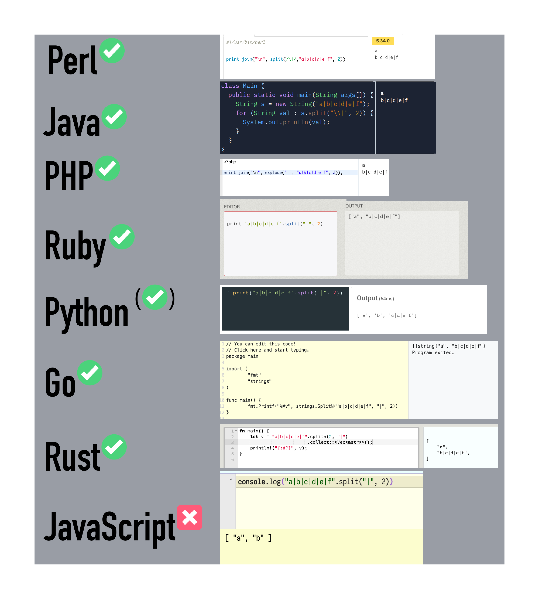

# Reversible string split



<small>Image from
<a href="https://twitter.com/DasSurma/status/1480555236473384964">@DasSurma</a></small>

## Status

Champion(s): Luca Casonato

Author(s): Luca Casonato

Stage: 1

## Motivation

The string split method in JavaScript behaves unlike the string split methods in
nearly all other languages. In JavaScript, a `split(sep, N)` is essentially a
regular split, but with the output array truncated to the first N values.
JavaScript considers the N to mean the number of splits _and_ the number of
return items.

In most other languages a `splitN` instead splits the original string into N
items, including a remainder. They thus split N-1 times. The last item in the
returned array contains the "remainder" of the string.

```perl
# Perl

print join('\n', split(/\|/, 'a|b|c|d|e|f', 2))

# a
# b|c|d|e|f
```

```php
<!-- PHP -->
<?php

print join("\n", explode("|", "a|b|c|d|e|f", 2));

# a
# b|c|d|e|f
```

```ruby
# Ruby

print 'a|b|c|d|e|f'.split('|', 2)

# ["a", "b|c|d|e|f"]
```

```go
// Go

package main

import (
  "fmt"
  "strings"
)

func main() {
  fmt.Printf("%#v", strings.SplitN("a|b|c|d|e|f", "|", 2))
}

// []string{"a", "b|c|d|e|f"}
```

```rust
// Rust

fn main() {
  let v = "a|b|c|d|e|f".splitn(2, "|").collect::<Vec<_>>();
  println!("{:?}", v);
}

// ["a", "b|c|d|e|f"]
```

```java
// Java

class Playground {
  public static void main(String[] args) {
    String s = new String("a|b|c|d|e|f");
    for(String val : s.split("\\|", 2)) {
      System.out.println(val);
    }
  }
}

// a
// b|c|d|e|f
```

```python
# Python

print('a|b|c|d|e|f'.split('|', 2))

# ['a', 'b', 'c|d|e|f']
```

```js
// JavaScript

console.log("a|b|c|d|e|f".split("|", 2));

// ["a", "b"]
```

The first 6/8 languages agree here. They consider the N to mean "the number of
items returned" and the remainder to be the last item in the returned array.
This means they actually split N-1 times.

Python also agree that the remainder should be returned as the last item in the
array. It disagrees with the rest about what N means though. Python splits N
times, and returns N+1 items.

JavaScript diverges from the pack completely though: it splits N times, and
returns N items, but does not return a remainder at all. It is the only language
to do so.

Even though Python and the other langauges are slightly different from each
other, all their algorithms have a common feature that JavaScript is missing:
their splits are reversible. This means that if you split a string into N items,
you can join them back together without losing any information.

Reversible splits have the property that for any string V and any seperator S
and any unsigned non 0 integer N, the following is valid:

```js
join(S, V.split(S, N)) == V;
```

This reversability allows using string splits for some very useful tasks, where
the current split method does not work. The most common use case for this are
prefix splits:

### Prefix splits

Many formats out there are character delimited. It is useful to be able to
easially split a string at those predefined "split points" into two parts. For
example the INI file format uses the `=` character to separate key-value pairs,
and the `\n` character to separate key-value pairs from each other.

```ini
key = value
other_key = 'value contains an = sign'
```

With the current "split" in JavaScript, parsing this is not as obvious as with
the "more popular" splitting algorithm:

```js
// Current JavaScript
const ini = Deno.readTextFileSync("./test.ini");
const entries = ini.split("\n").map((line) => {
  const [key, ...rest] = line.split("=");
  return [key, rest.join("=")];
});

// Other languages
const ini = Deno.readTextFileSync("./test.ini");
const entries = ini.split("\n").map((line) => line.splitN("=", 2));
```

> **Note:** I am aware this could be made more efficient with a different
> "parser". That is not the point. The point is to make the obvious thing easy.

This behaviour is not just relevant for the INI file format, but also for things
like HTTP headers in HTTP/1.1, key value pairs in `Cookie` headers, and many
more.

## Proposal

The proposal is to add reversible string split support to JavaScript. This
propsal proposes the addition of a `String.prototype.splitN` method that splits
the input string at most N-1 times, returning N substrings. The last item
contains the remainder of the string.

```js
console.log("a|b|c|d|e|f".splitN("|", 2));
// ["a", "b|c|d|e|f"]
```

The naming is taken from Rust and Go.

## Q&A

### Could this be an extra option for the `split` method?

Yes. This could also be an option in a new options bag for split. Example:

```js
console.log("a|b|c|d|e|f".split("|", { n: 2 }));
// or
console.log("a|b|c|d|e|f".split("|", 2, true));
// or
console.log("a|b|c|d|e|f".split("|", { n: 2, remainder: true }));
// or
console.log("a|b|c|d|e|f".split("|", 2, { remainder: true }));
```

The first may be confusing to users though, as it is not obvious that the return
value between `split("|", 2)` and `split("|", { n: 2 })` is different. These
kinds of overloads exist on the web platform (e.g. `addEventListener`), but the
form you use does not impact behaviour.

The second is more clear, but at the same time also less clear, because it is
not obvious what the `true` value in the third argument is.

The third option is pretty clear, but is also the most verbose. The verbosity
may make it cumbersome to use.

The 4th option is probably the "cleanest". Because the extra option is ignored
in current engines, it might make it look like the extra option is supported,
whereas in fact it is not - it is just being ignored.

Which of the 4 proposed options should ultimately be used should be up to the
committee as a whole. I don't really care (although I prefer the `splitN`
option).

### I like the current behaviour of split!

No worries! It isn't going away. The new `splitN` function is meant to simplify
the usecases described above. You can continue to use `split` as it exists now.

### Why is JavaScript's split so different from other languages?

To be completly honest: we don't really know. Nobody we have asked has been able
to give us a good answer yet. What we do know:

- Netscape Navigator 4, released in June 1997 was the first browser to support
  the second argument to the `split` method with it's current behaviour. NN3
  released 10 months prior did not have it.
- IE 4, released 4 months later, does not have this feature/behaviour.
- The first ECMA262 version this behaviour is specified is ES3.
- The behaviour did not come from Java. It only added a `String.split` method in
  version 1.4 (2002).

Thanks to @hax and @aimingoo for the research on this.
